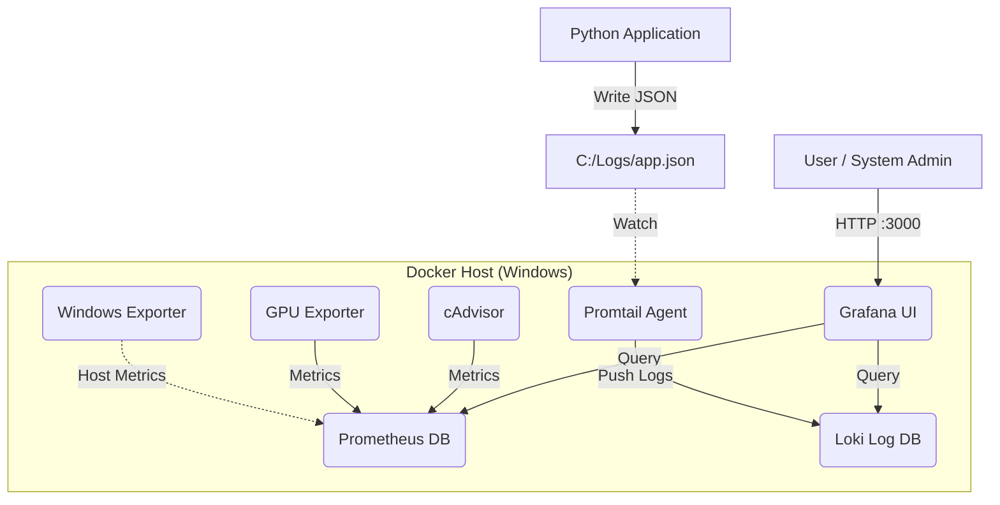

# System Architecture

dLogs is built on the **LGTM** stack (Loki, Grafana, Promtail, Prometheus), containerized with Docker.

## Components Map

## Data Flow

1.  **Metrics**: Prometheus scrapes `windows_exporter` (:9182), `cadvisor` (:8080), and `nvidia_exporter` (:9835) every 15 seconds.
2.  **Logs**: Applications write to files in `C:\Logs`. Promtail tails these files and pushes streams to Loki.
3.  **Visualization**: Grafana queries both Prometheus (for graphs) and Loki (for text logs) to render dashboards.

## Self-Healing

The `install_dlogs.ps1` script includes self-healing logic:

- **Directory Repair**: If `C:\dLogs\config\promtail.yml` is corrupted as a directory (common Docker mount error), it deletes and creates the file correctly.
- **Config Regeneration**: It regenerates `prometheus.yml` on every run to ensure scrape targets match the current environment (e.g. enabling/disabling GPU targets).
