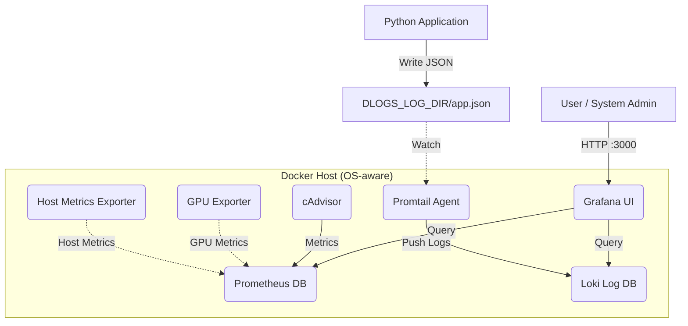

# System Architecture

dLogs is built on the **LGTM** stack (Loki, Grafana, Promtail, Prometheus), containerized with Docker.

## Components Map

## Data Flow

1.  **Metrics**: Prometheus always scrapes itself and `cadvisor` every 15 seconds, then adds OS-aware scrape targets generated by `dlogs up`. On Linux this is the built-in dLogs host exporter on `:9100`; on Windows it is `windows_exporter` on `:9182`; on other environments it falls back to `node-exporter`. GPU metrics come from the host-side `nvidia-smi` exporter on `:9835` when available, or from the optional Docker `nvidia_gpu_exporter` profile.
2.  **Logs**: Applications write to files in `DLOGS_LOG_DIR`. Promtail tails these files and pushes streams to Loki.
3.  **Visualization**: Grafana queries both Prometheus (for graphs) and Loki (for text logs) to render dashboards.

## Self-Healing

The CLI includes self-healing logic:

- **Directory Repair**: `dlogs init` writes `.env` with an OS-appropriate `DLOGS_LOG_DIR` and creates the host log directory automatically.
- **Config Regeneration**: `dlogs up` regenerates `.dlogs-state/prometheus/*.json` on every run so scrape targets match the current OS and GPU runtime.
